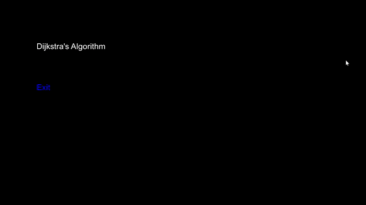

# Visualising Pathfinding Algorithms in C++, using SFML

## Motivation
After creating a sorting algorithm visualiser, I decided the next coolest thing I could do was to visualise a pathfinding algorithm!

## Installation
***If*** you would like to contribute (adding new algorithms should be really trivial, just make sure to call the draw function each time you
dequeue an item from the queue which stores all grid items, the menu is a little bit messy but it's basically all in a switch statement) you will need to download SFML. 

I recommend following ***[this tutorial](https://youtu.be/YfMQyOw1zik)*** to get it running on a simple boilerplate project for the first time, and then linking the dependencies with this project once you've 
cloned my repo to your computer. 
If you want to statically link your dependencies, ***[follow this other tutorial](https://youtu.be/uc0RSR9i1tM)***.

After you link your dependencies, you should be able to build and run the code. Note that throughout the entire development process I used Visual Studio.

## Algorithms implemented
So far the following pathfinding algorithm is implemented:
1. Dijkstra's Algorithm

If I have time, I would like to do the following:
- [ ] Add A*'s visualisation
- [ ] Implement the option to add weights on the 2D Grid Map for weighted pathfinding algorithms.
- [ ] Add some text during the grid selection process (currently, green represents home, and blue is target. Although you would never know, because the algorithm doesnt care about that really.)

## GIF of the sorting visualiser!

